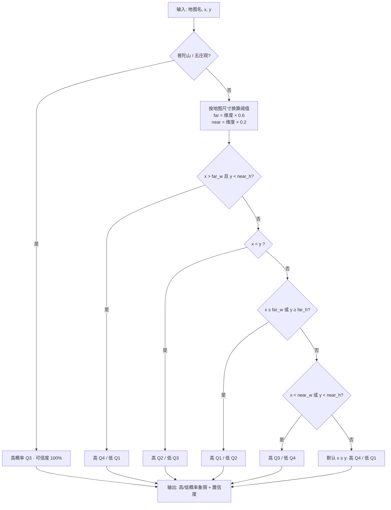

# 抓鬼象限预测逻辑说明

> 文档依据 `backend/services/ghost_predictor.py` 当前真实代码生成（2026-08-18）。
> 预测逻辑为**纯启发式规则，不依赖任何 AI 模型**（地名兜底识别模型已于 2026-08-16 删除）。

---

## 1. 概述

- **输入**：地图名 + 游戏逻辑坐标 `(x, y)`
- **输出**：高概率象限、低概率象限、置信度描述
- **坐标范围**：`x ∈ [0, 该图宽]`、`y ∈ [0, 该图高]`；OCR 解析器另有全局兜底守卫 `1 ≤ x ≤ 700`、`1 ≤ y ≤ 350`（超出视为误识丢弃）。
- **象限定义**（坐标把地图四等分，游戏 `y=0` 在底部，`y` 越大越靠上）：

```
   2 | 1
  -----
   3 | 4
```

---

## 2. 流程图



---

## 3. 预测规则详表

阈值按地图尺寸比例换算（**x 用图宽、y 用图高各自算**）：

```python
x_far,  x_near = map_w * 0.6, map_w * 0.2
y_far,  y_near = map_h * 0.6, map_h * 0.2
```

| 顺序 | 条件 | 高概率 | 低概率 | 含义 |
|---|---|---|---|---|
| 特例 | 地图为 `普陀山` 或 `五庄观` | Q3 | 无 | 小图规律特殊，写死 |
| 1 | `x > x_far` **且** `y < y_near` | Q4 | Q1 | 右下角区域 |
| 2 | `x < y` | Q2 | Q3 | 偏左上（对角线判断，与尺寸无关） |
| 3 | `x ≥ x_far` **或** `y ≥ y_far` | Q1 | Q2 | 偏右或偏上 |
| 4 | `x < x_near` **或** `y < y_near` | Q3 | Q4 | 贴左边或贴下边 |
| 5 | 默认（前 4 条都不满足，即 `x ≥ y` 且居中） | Q4 | Q1 | 偏右下 |

> **分支优先级**：第 1 条"右下角"先于第 3 条，所以右下同时存在时归 Q4；第 2 条 `x<y` 先于第 4 条，所以左上区域归 Q2。
> **四角规律（原 25%/75% 边界）已于 2026-08-17 整段禁用**，坐标偏边缘时不再单独判角落。

**置信度**：
- 高概率仅 1 个 且 低概率 ≤ 1 个 → **"可信度：高"**
- 其它 → **"可信度：中"**

---

## 4. 阈值常量说明

`ghost_predictor.py` 模块顶部：

```python
QUADRANT_FAR_RATIO  = 0.6   # 远端判定比例（替代原绝对阈值 150）
QUADRANT_NEAR_RATIO = 0.2   # 贴边判定比例（替代原绝对阈值 50）
```

**为什么改成比例**：原代码写死 `150 / 50` 绝对阈值，对所有地图一视同仁，但在尺寸差异巨大的地图上尺度混乱——

| 地图 | 宽×高 | 原 `x > 150` 含义 | 原 `y < 50` 含义 |
|---|---|---|---|
| 宝象国 | 160×120 | 仅最右 ~6% | 底部 42% |
| 大唐境外 | 640×120 | 距左仅 23% | **不可能触发**（y 最大 120） |
| 普陀山 | 95×72 | **不可能触发**（x 最大 95） | 底部 69% |

改成按各图宽高比例后，每张图上"远/近"判定尺度一致。调宽松/严格只改顶部两个常量即可。

---

## 5. 地图逻辑尺寸表（11 张）

坐标为**游戏逻辑坐标**（非像素）。`width × height` 即该图坐标有效范围。

| 地图 | 逻辑宽 | 逻辑高 | 底图文件 | 备注 |
|------|------|------|------|------|
| 傲来国 | 224 | 150 | `alg.png` | |
| 宝象国 | 160 | 120 | `bxg.png` | |
| 长寿村 | 160 | 210 | `csc.png` | |
| 大唐境外 | 640 | 120 | `dtjw.png` | 最长的一张 |
| 建邺城 | 288 | 144 | `jyc.png` | |
| 江南野外 | 160 | 120 | `jnyw.png` | |
| 女儿村 | 130 | 144 | `nec.png` | |
| 普陀山 | 95 | 72 | `pts.png` | **特殊：永远 Q3** |
| 五庄观 | 100 | 75 | `wzg.png` | **特殊：永远 Q3** |
| 西凉女国 | 163 | 124 | `xlng.png` | |
| 朱紫国 | 191 | 120 | `zzg.png` | |

> 对方抓鬼站共 27 张地图（含坐标边界清单已存档于 `backend/data/competitor_maps.json`），我方目前覆盖 11 张，差 16 张。

---

## 6. 前端展示（与预测逻辑是两回事）

后端只返回象限编号，前端 `ghost_monitor.html` 的 `renderGhostMap` 负责画：

- **高概率象限** → 深红蒙版
- **低概率象限** → 浅黄蒙版
- **当前坐标点** → 黄框 + 黄圆点；黄框大小 = 坐标点**上下左右各 ±50 游戏单位**（整框 100×100），不是 ±25
- 小地图（普陀山/五庄观等每单位像素密度高）加了 `maxSide = 短边 × 35%` 上限防止溢出，语义仍是 ±50
- 画中画（PiP）每 **120ms** 重绘

---

## 7. 与识别链路的关系

```
截图(任务追踪区下方裁剪)
  → RapidOCR (PP-OCRv6 SMALL, use_cls=False)
  → 鲁棒解析 (坐标模式1/2/3 + 逗号粘连修复)
  → 关键词匹配 + 归一化互补 (无地名兜底模型)
  → 得到 (地图名, x, y)
  → ghost_predictor.predict_position_areas()  ← 本文档所述逻辑
  → 返回 高/低概率象限 + 置信度
  → 前端 canvas 自绘底图 + 画点
```
